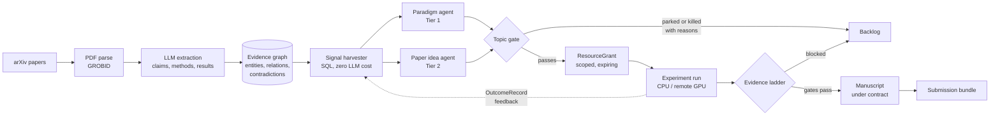
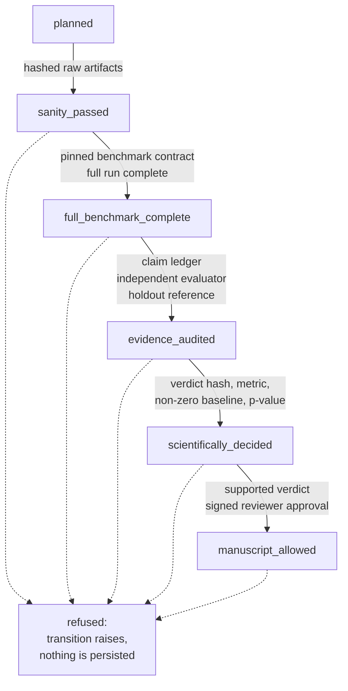
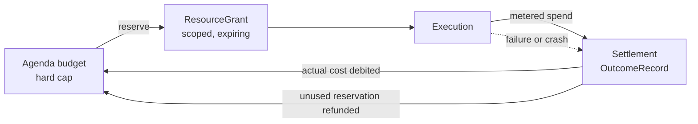

<div align="center">

# DeepGraph

**An open research engine that reads the literature at scale, turns it into a
structured evidence graph, and carries the promising directions through
contracted, budgeted, auditable experiments.**

`Python 3.12+` &nbsp;·&nbsp; `PostgreSQL` &nbsp;·&nbsp; `CPU / remote GPU` &nbsp;·&nbsp; `Apache-2.0`

[中文文档](README.zh-CN.md) &nbsp;·&nbsp;
[Deploy](docs/DEPLOY.md) &nbsp;·&nbsp;
[Showcase](docs/SHOWCASE.md) &nbsp;·&nbsp;
[Roadmap](docs/ROADMAP.md)

</div>

---

## Design principle: The Bitter Lesson

Rich Sutton's *Bitter Lesson* observes that across seventy years of AI, general
methods that scale with computation eventually overtake methods built on
hand-encoded human knowledge. DeepGraph takes that as an architectural
commitment rather than a slogan, and it is the reason the system is shaped the
way it is:

- **General search is the core, not a library of expert heuristics.** Research
  candidates come from a cheap SQL signal harvester sweeping the whole graph
  plus general idea agents -- not from hand-curated topic lists. Scaling the
  paper corpus and the compute budget widens the search directly.
- **Hand-written domain knowledge is quarantined.** Domain runners and method
  aliases live in opt-in plugins (`plugins/examples/cggr/`). By design, no
  hand-written domain agent is granted independent budget authority, so
  specialist code can never quietly become the thing that decides where
  resources go.
- **Policies are replaceable by learning.** The current portfolio policy is a
  deliberately transparent best-of-N heuristic with logged inputs, confidence
  intervals and opportunity cost -- structured so it can be swapped for a
  constrained contextual bandit or Thompson sampler once enough
  `OutcomeRecord` history exists (`docs/internal/ARCHITECTURE.md`).
- **Feedback, not patches.** Failures are meant to be absorbed by a general
  run-observe-repair loop and fed back as outcome records, instead of being
  answered with another special case in code.
- **Compute is the budgeted primitive.** Every unit of spend is reserved,
  metered and settled against an agenda budget, which is what makes "scale the
  compute" a controlled operation rather than an open tap.

Scaled search only pays off if the filter that decides *what is true* scales
with it. That filter is the evidence ladder below, and it is the other half of
this system.

---

## What it does



1. **Ingest** -- arXiv discovery, PDF parsing, LLM extraction of claims,
   methods, results and taxonomy into PostgreSQL.
2. **Graph** -- entities, relations, contradictions and evidence links merged
   across papers, with entity resolution and domain summaries.
3. **Discover** -- a zero-LLM-cost SQL signal harvester finds overlaps,
   convergent patterns, contradiction clusters and plateaus; paradigm and
   paper-idea agents turn them into executable research candidates.
4. **Execute** -- candidates that pass the gates get a scoped resource grant, a
   frozen benchmark contract and a run on CPU or remote GPU.
5. **Write** -- manuscript generation under contract: claim-evidence matrices,
   reviewer simulation, figure and layout audits, PDF sanity checks.

---

## Why it is different

Most automated-research systems treat *the job finished* as *the result is
real*. DeepGraph is built on the opposite premise, and that discipline is its
core innovation.

### 1. An evidence ladder with content-hash gates

A result climbs one step at a time, and every step demands hashed raw
artifacts, a pinned benchmark contract and an independent evaluation. A
transition whose evidence is missing does not get recorded as a failure -- it
is refused outright, so the ladder cannot drift
(`meta_harness/evidence_state.py`).



### 2. Two registers, never merged

*Did it run* and *what does the audited evidence say* are stored, served and
displayed separately, down to the dashboard badges. A job whose operational
status is `completed` stays scientifically `not assessed` until the evidence
says otherwise. The system cannot dress process up as proof.

| Register | Question it answers | Vocabulary |
|---|---|---|
| **Operational** (`RUN`) | Did the job execute? | `planned`, `running`, `completed`, `failed`, `cancelled` |
| **Scientific** (`EVIDENCE` / `DECIDED`) | What does the audited evidence say? | `not assessed`, `sanity_passed`, `full_benchmark_complete`, `evidence_audited`, `decided`, `manuscript_allowed` |

### 3. A topic gate that prices admission in bits

Before a candidate may spend anything it must carry a pre-registered
prediction; expected information gain is then computed as a pure function --
no LLM, no database lookup, and no on/off switch to disable it
(`agents/topic_gate.py`). Candidates that fail are parked or killed *with
recorded reasons*, so a rejection is auditable rather than silent.

### 4. Grant economics: reserve, measure, settle



Nothing runs grantless, and failures settle as honestly as successes -- a
system that only ever settles its wins cannot be trusted to account for
anything.

### 5. Manuscript gates that can say no

A paper claim must trace to a frozen contract, a complete evidence manifest,
multi-seed statistics and a signed reviewer approval before `manuscript_allowed`
(`contracts/scientific_evidence.py`, `agents/paper_completeness.py`). A bundle
that fails its quality gates is stamped `DO_NOT_SUBMIT.md` with a concrete
repair list instead of being shipped.

### 6. Operations as part of the contract

SHA-pinned deployment manifests, additive-only migrations, a self-heal
watchdog that takes at most one action per tick, and read-only audit scripts
(`orchestrator/selfheal_policy.py`, `deploy/`).

---

## Scale

Operational snapshot, 2026-08-07, from the live `/api/stats`:

| | |
|---|---|
| Papers | 21,677 collected, 6,729 fully processed |
| Structured evidence | 28,700 claims, 156,194 results, 238 contradiction clusters |
| Knowledge graph | 248,441 entities, 735,913 relations, 5,051 taxonomy nodes |
| Discovery | 11,936 insights, 110 deep insights, 25,652 mapped opportunities |
| Execution | 115 experiment runs, 99 GPU jobs, 17 registered workers |
| Investment | 921M LLM tokens |

Demo walkthrough and case studies: **[docs/SHOWCASE.md](docs/SHOWCASE.md)**.

---

## Quick start

Python 3.12+ and an LLM API key are the minimum; PostgreSQL enables the full
control plane.

```bash
python3.12 -m venv .venv
source .venv/bin/activate
pip install -r requirements.txt
cp .env.example .env    # set at least DEEPGRAPH_LLM_API_KEY
export $(grep -v '^#' .env | xargs)
python3.12 main.py
```

Open `http://localhost:8080`.

Full deployment -- PostgreSQL migration, systemd units, remote GPU backends,
configuration reference: **[docs/DEPLOY.md](docs/DEPLOY.md)**.

---

## Repository map

| Directory | Purpose |
|---|---|
| `contracts/` | Versioned record types and their validation rules |
| `meta_harness/` | Control plane: ladder, grants, authorities, repository |
| `ingestion/` | arXiv discovery and PDF parsing |
| `agents/` | Extraction, insight generation, gating, experiment orchestration |
| `db/` | Schema, migrations, taxonomy, evidence graph, entity resolution |
| `orchestrator/` | Scheduling, workers, self-heal policy, compute runtime |
| `web/` | Flask API, provenance API, dashboard |
| `deploy/` | Systemd units, Caddyfile, deployment manifests |
| `scripts/` | Operator CLIs, audits, migrations, manifest tooling |
| `plugins/` | Self-contained experiment harnesses, e.g. `examples/cggr` |
| `tests/` | 90 test modules |

## Documentation

| Document | What it covers |
|---|---|
| [docs/DEPLOY.md](docs/DEPLOY.md) | Full deployment: database, systemd, GPU backends, configuration |
| [docs/SHOWCASE.md](docs/SHOWCASE.md) | Live numbers, demo route, case studies |
| [docs/ROADMAP.md](docs/ROADMAP.md) | What is next |
| [docs/upgrade-plan-v1-v2.md](docs/upgrade-plan-v1-v2.md) | The V1 to V2 upgrade plan |
| [LATENT_COMMUNICATION_RESEARCH.md](LATENT_COMMUNICATION_RESEARCH.md) | The team's latent-communication research line |
| `docs/internal/` | Operator runbooks, state dictionary, configuration and architecture reference |

Release history: [CHANGELOG.md](CHANGELOG.md), maintained separately.

## Tests

```bash
python3.12 -m unittest discover -s tests
```

Read-only audit scripts, safe against a live deployment:

```bash
python3.12 scripts/meta_harness_scope_audit.py
python3.12 scripts/meta_harness_sql_audit.py
python3.12 scripts/meta_harness_static_audit.py
```

## Data and security

- No hardcoded credentials; secrets come from the environment as *references*,
  not stored values. SSH execution requires strict known-host pinning.
- Public API responses pass through a scrubber that strips path and log keys
  and redacts absolute paths; the SSE stream is scrubbed the same way
  (`web/app.py:84-106`).
- Every parameterless GET route is walked by a leak-guard test asserting no
  filesystem paths or log tails appear in any response
  (`tests/test_provenance_web.py:282`).

## License

See [LICENSE](LICENSE).
