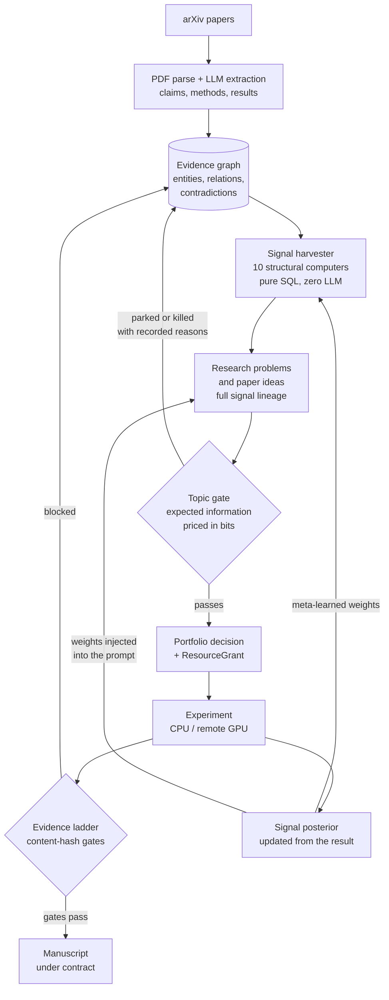
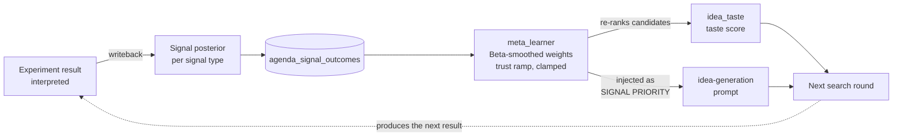
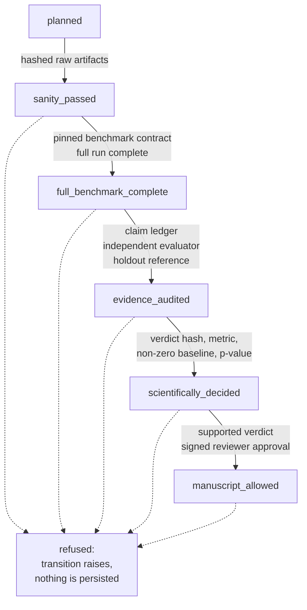
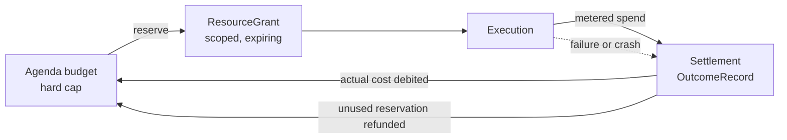

<div align="center">

# DeepGraph

**An open research engine that reads the literature at scale, turns it into a
structured evidence graph, and carries the promising directions through
contracted, budgeted, auditable experiments.**

`Python 3.12+` &nbsp;·&nbsp; `PostgreSQL` &nbsp;·&nbsp; `CPU / remote GPU` &nbsp;·&nbsp; `Apache-2.0`

[中文文档](README.zh-CN.md) &nbsp;·&nbsp;
[Deploy](docs/DEPLOY.md) &nbsp;·&nbsp;
[Showcase](docs/SHOWCASE.md) &nbsp;·&nbsp;
[Roadmap](docs/ROADMAP.md)

</div>

---

## Design principle: The Bitter Lesson

Rich Sutton's *Bitter Lesson* observes that across seventy years of AI, general
methods that scale with computation eventually overtake methods built on
hand-encoded human knowledge. For a system whose job is to *do research*, that
translates into a hard question: where do the research questions come from? If
they come from a human's topic list, the system's ceiling is that human. So in
DeepGraph they come from structure in the corpus, and the ranking that decides
which ones to fund is learned from experiment outcomes rather than tuned by
hand.

Each commitment below is a specific mechanism in this repository, not a stance:

| Bitter Lesson commitment | What it is in DeepGraph | Where |
|---|---|---|
| Search, not curated knowledge | Ten structural signal computers join over the whole evidence graph in **pure SQL, zero LLM calls**, to enumerate research openings: entity overlap, contradiction clusters, performance plateaus, negative-space gaps, claim-method gaps, mechanism mismatches, hidden-variable bridges | `agents/signal_harvester.py:453-1662`, entry `harvest_all():1828` |
| Ranking is learned, not tuned | Experiment outcomes update a per-signal-type posterior; the learned weights re-rank future candidates *and* are injected into the idea-generation prompt | `agents/meta_learner.py:200`, `agents/idea_taste.py:74`, `agents/paper_idea_agent.py:580-583` |
| Hand-written knowledge holds no budget | The frontier authority is capped at 20k tokens / 120 minutes / **0.0 GPU hours** and "cannot become a ResourceGrant"; only a persisted portfolio decision can mint one; plugins are outside the agent registry entirely | `contracts/meta_harness.py:131-216`, `meta_harness/portfolio.py:269-272`, `plugins/__init__.py:1-3` |
| Policy is swappable by construction | The portfolio policy is a frozen, versioned dataclass injected at call time, every input an `Estimate` carrying a confidence interval and its evidence sources -- so a bandit or Thompson sampler drops in without touching callers | `meta_harness/portfolio.py:12-36,102`, `contracts/meta_harness.py:52-81` |
| Compute is the budgeted primitive | Every spend is reserved, metered and settled against an agenda budget, so "add compute" is a controlled dial rather than an open tap | `meta_harness/repository.py:691`, `orchestrator/bounded_execution.py` |

Scaled search only pays off if the filter deciding *what is true* scales with
it. That filter is the evidence ladder, and it is the other half of this
system.

---

## How the loop runs

DeepGraph is a cycle, not a pipeline: papers become structure, structure
becomes candidates, candidates that survive the gate become experiments, and
experiment outcomes change which kinds of structure get searched next.



1. **Ingest** -- arXiv discovery, PDF parsing, LLM extraction of claims,
   methods, results and taxonomy into PostgreSQL, under a scoped grant
   (`orchestrator/scoped_ingestion_worker.py:32`).
2. **Structure** -- entities, relations, contradictions and evidence links
   merged across papers, with entity resolution and domain summaries.
3. **Search** -- the signal harvester sweeps the graph for structural
   openings; problem and idea agents turn them into executable candidates,
   each stamped with the exact signal rows, papers, prompt version and model
   version it came from (`db/schema_v2.sql:44-49`).
4. **Select** -- the topic gate prices admission in bits; the portfolio policy
   ranks survivors and issues a scoped, expiring grant.
5. **Execute and learn** -- the run produces evidence, and its result updates
   the posterior of the signal type that generated it.

---

## Why it is different

Three properties, in the order they matter: the system searches for its own
research questions, it changes how it searches based on what worked, and a
scaled search is only useful because everything downstream refuses to call an
unproven result a finding.

### 1. It searches its own question space

The candidate pool is not a topic list. Ten computers in
`agents/signal_harvester.py` look for places where the literature is
structurally *interesting* -- two subfields that overlap without citing each
other, a metric that has plateaued across papers, a claim with no method
attached, a mechanism asserted in one place and contradicted in another,
variables that bridge otherwise unconnected results. They run as SQL joins
over the whole graph with **no LLM in the path at all**
(`agents/signal_harvester.py:3,9-18`), which is why widening the corpus widens
the search rather than the bill.

Human input enters as *scope*, not as content: an agenda restricts which part
of the space may be searched (`agents/topic_gate.py:248`), but never supplies
the candidates. Every candidate carries machine-checkable lineage back to the
signal rows and papers that produced it, so any proposal can be traced to the
structure that suggested it.

### 2. It changes how it searches, from evidence



When an experiment finishes, `agents/result_interpreter.py:636` hands the
verdict to `agents/problem_first.py:721`, which updates the posterior of the
signal type that produced the idea (`:567`) and records it in
`agenda_signal_outcomes` (`:614`). `agents/meta_learner.py:200` turns that
history into Beta-smoothed weights with a trust ramp, clamped to a bounded
range so no single result can dominate (`:231-234`). Those weights then do two
things: they re-rank future candidates through `agents/idea_taste.py:74`, and
they are written into the generation prompt itself as an explicit
`SIGNAL PRIORITY (meta-learned weights)` block
(`agents/paper_idea_agent.py:580-583`).

The effect is that signal types which have produced real effects get more of
the search budget, and ones that have not get less -- without anyone editing a
weight. The loop is deliberately kept **per agenda**: a docstring at
`agents/meta_learner.py:204` refuses the older global table precisely so one
agenda's outcomes cannot leak into another's ranking.

### 3. The gates are what make scaled search worth running

An automated searcher that cannot tell a real result from a lucky one just
produces noise faster. Everything below exists so that scaling the search
scales the evidence, not the claims.

#### 3.1 An evidence ladder with content-hash gates

A result climbs one step at a time, and every step demands hashed raw
artifacts, a pinned benchmark contract and an independent evaluation. A
transition whose evidence is missing does not get recorded as a failure -- it
is refused outright, so the ladder cannot drift
(`meta_harness/evidence_state.py`).



#### 3.2 Two registers, never merged

*Did it run* and *what does the audited evidence say* are stored, served and
displayed separately, down to the dashboard badges. A job whose operational
status is `completed` stays scientifically `not assessed` until the evidence
says otherwise. The system cannot dress process up as proof.

| Register | Question it answers | Vocabulary |
|---|---|---|
| **Operational** (`RUN`) | Did the job execute? | `planned`, `running`, `completed`, `failed`, `cancelled` |
| **Scientific** (`EVIDENCE` / `DECIDED`) | What does the audited evidence say? | `not assessed`, `sanity_passed`, `full_benchmark_complete`, `evidence_audited`, `decided`, `manuscript_allowed` |

#### 3.3 A topic gate that prices admission in bits

Before a candidate may spend anything it must carry a pre-registered
prediction; expected information gain is then computed as a pure function --
no LLM, no database lookup, and no on/off switch to disable it
(`agents/topic_gate.py`). Candidates that fail are parked or killed *with
recorded reasons*, so a rejection is auditable rather than silent.

#### 3.4 Grant economics: reserve, measure, settle



Nothing runs grantless, and failures settle as honestly as successes -- a
system that only ever settles its wins cannot be trusted to account for
anything.

#### 3.5 Manuscript gates that can say no

A paper claim must trace to a frozen contract, a complete evidence manifest,
multi-seed statistics and a signed reviewer approval before `manuscript_allowed`
(`contracts/scientific_evidence.py`, `agents/paper_completeness.py`). A bundle
that fails its quality gates is stamped `DO_NOT_SUBMIT.md` with a concrete
repair list instead of being shipped.

#### 3.6 Operations as part of the contract

SHA-pinned deployment manifests, additive-only migrations, a self-heal
watchdog that takes at most one action per tick, and read-only audit scripts
(`orchestrator/selfheal_policy.py`, `deploy/`).

---

## Scale

Operational snapshot, 2026-08-07, from the live `/api/stats`:

| | |
|---|---|
| Papers | 21,677 collected, 6,729 fully processed |
| Structured evidence | 28,700 claims, 156,194 results, 238 contradiction clusters |
| Knowledge graph | 248,441 entities, 735,913 relations, 5,051 taxonomy nodes |
| Discovery | 11,936 insights, 110 deep insights, 25,652 mapped opportunities |
| Execution | 115 experiment runs, 99 GPU jobs, 17 registered workers |
| Investment | 921M LLM tokens |

Demo walkthrough and case studies: **[docs/SHOWCASE.md](docs/SHOWCASE.md)**.

---

## Quick start

Python 3.12+ and an LLM API key are the minimum; PostgreSQL enables the full
control plane.

```bash
python3.12 -m venv .venv
source .venv/bin/activate
pip install -r requirements.txt
cp .env.example .env    # set at least DEEPGRAPH_LLM_API_KEY
export $(grep -v '^#' .env | xargs)
python3.12 main.py
```

Open `http://localhost:8080`.

Full deployment -- PostgreSQL migration, systemd units, remote GPU backends,
configuration reference: **[docs/DEPLOY.md](docs/DEPLOY.md)**.

---

## Repository map

| Directory | Purpose |
|---|---|
| `contracts/` | Versioned record types and their validation rules |
| `meta_harness/` | Control plane: ladder, grants, authorities, repository |
| `ingestion/` | arXiv discovery and PDF parsing |
| `agents/` | Extraction, insight generation, gating, experiment orchestration |
| `db/` | Schema, migrations, taxonomy, evidence graph, entity resolution |
| `orchestrator/` | Scheduling, workers, self-heal policy, compute runtime |
| `web/` | Flask API, provenance API, dashboard |
| `deploy/` | Systemd units, Caddyfile, deployment manifests |
| `scripts/` | Operator CLIs, audits, migrations, manifest tooling |
| `plugins/` | Self-contained experiment harnesses, e.g. `examples/cggr` |
| `tests/` | 90 test modules |

## Documentation

| Document | What it covers |
|---|---|
| [docs/DEPLOY.md](docs/DEPLOY.md) | Full deployment: database, systemd, GPU backends, configuration |
| [docs/SHOWCASE.md](docs/SHOWCASE.md) | Live numbers, demo route, case studies |
| [docs/ROADMAP.md](docs/ROADMAP.md) | What is next |
| [docs/upgrade-plan-v1-v2.md](docs/upgrade-plan-v1-v2.md) | The V1 to V2 upgrade plan |
| `docs/internal/` | Operator runbooks, state dictionary, configuration and architecture reference |

Release history: [CHANGELOG.md](CHANGELOG.md), maintained separately.

## Tests

```bash
python3.12 -m unittest discover -s tests
```

Read-only audit scripts, safe against a live deployment:

```bash
python3.12 scripts/meta_harness_scope_audit.py
python3.12 scripts/meta_harness_sql_audit.py
python3.12 scripts/meta_harness_static_audit.py
```

## Data and security

- No hardcoded credentials; secrets come from the environment as *references*,
  not stored values. SSH execution requires strict known-host pinning.
- Public API responses pass through a scrubber that strips path and log keys
  and redacts absolute paths; the SSE stream is scrubbed the same way
  (`web/app.py:84-106`).
- Every parameterless GET route is walked by a leak-guard test asserting no
  filesystem paths or log tails appear in any response
  (`tests/test_provenance_web.py:282`).

## License

See [LICENSE](LICENSE).
