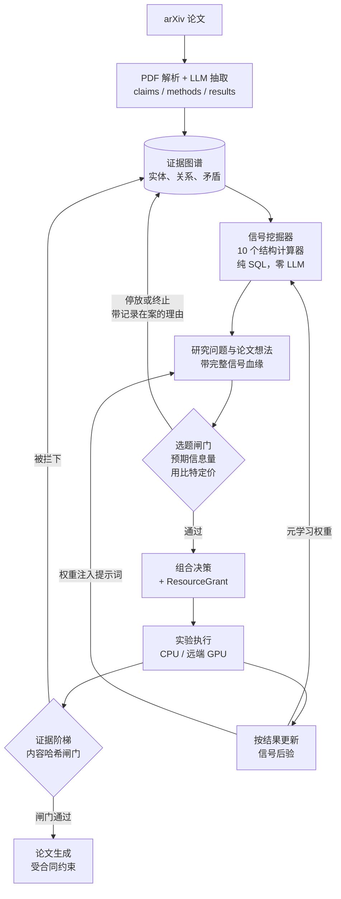
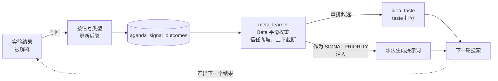
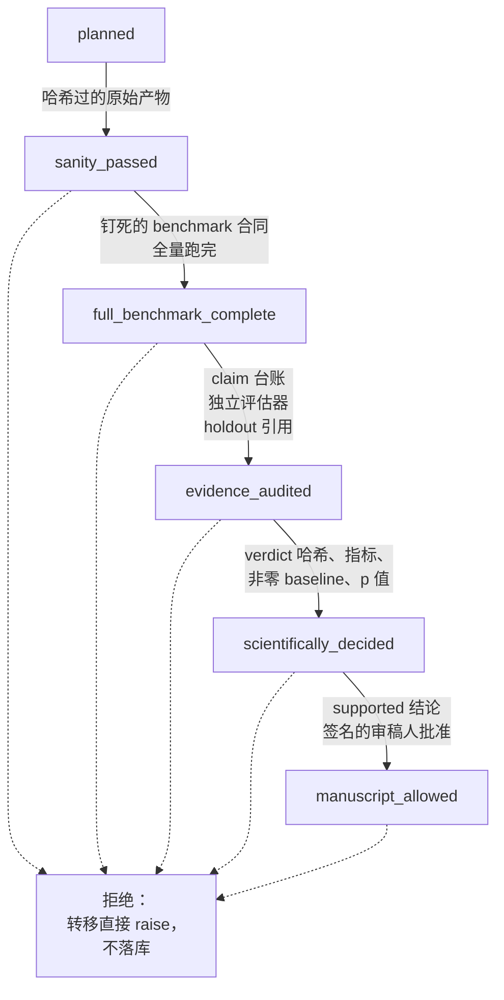
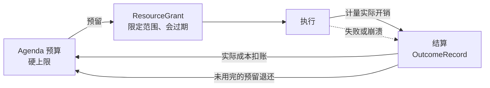

<div align="center">

# DeepGraph

**一个开放的科研引擎：规模化地读文献，把它变成结构化的证据图谱，
并把有希望的方向推进到有合同、有预算、可审计的实验。**

`Python 3.12+` &nbsp;·&nbsp; `PostgreSQL` &nbsp;·&nbsp; `CPU / 远端 GPU` &nbsp;·&nbsp; `Apache-2.0`

[English](README.md) &nbsp;·&nbsp;
[部署](docs/DEPLOY.md) &nbsp;·&nbsp;
[成果展示](docs/SHOWCASE.md) &nbsp;·&nbsp;
[路线图](docs/ROADMAP.md)

</div>

---

## 当前 V1 范围

V1 是可审计的试点实验执行控制面，不是自主科学家。真实 Colab T4 验收以
Qwen2.5-0.5B 完成了 GSM8K 的 4 个样本、3 个随机种子试点，留下已校验的产物、
已结算的资源用量和 `sanity_passed` 的负向/证伪 `OutcomeRecord`。它不代表已取得
科学发现、A100 基准结果，或可无人值守的生产科研。

## 设计原则：The Bitter Lesson

下面每一条都对应本仓库里的一个具体机制，不是表态：

| Bitter Lesson 约束 | 在 DeepGraph 里是什么 | 代码位置 |
|---|---|---|
| 要搜索，不要人工整理的知识 | 十个结构信号计算器以**纯 SQL、零 LLM 调用**在全图上做联接，枚举研究切入点：实体重叠、矛盾簇、性能平台期、负空间缺口、claim-方法缺口、机制冲突、隐变量桥接 | `agents/signal_harvester.py:453-1662`，入口 `harvest_all():1828` |
| 排序是学出来的，不是调出来的 | 实验结果更新各信号类型的后验；学到的权重既重排后续候选，又被注入想法生成的提示词 | `agents/meta_learner.py:200`、`agents/idea_taste.py:74`、`agents/paper_idea_agent.py:580-583` |
| 人工知识拿不到预算 | frontier 权限被硬性限死在 2 万 token / 120 分钟 / **0.0 GPU 小时**，且"不可能变成 ResourceGrant"；只有落库的组合决策才能签发授权；插件完全在 agent 注册表之外 | `contracts/meta_harness.py:131-216`、`meta_harness/portfolio.py:269-272`、`plugins/__init__.py:1-3` |
| 策略在结构上可被替换 | 组合决策策略是一个冻结的、带版本号的 dataclass，调用时注入；每个输入都是带置信区间和证据来源的 `Estimate`——所以换成 bandit 或 Thompson 采样不需要改调用方 | `meta_harness/portfolio.py:12-36,102`、`contracts/meta_harness.py:52-81` |
| 算力是被预算化的基本单位 | 每一笔开销都先预留、再计量、最后对着 agenda 预算结算，"把算力加上去"因此是一个受控旋钮而不是水龙头 | `meta_harness/repository.py:691`、`orchestrator/bounded_execution.py` |

规模化的搜索只有在"判断什么是真的"这个筛子同样能规模化时才划算。那个筛子就是
证据阶梯，它是这套系统的另一半。

---

## 这个环怎么转

DeepGraph 是一个环，不是一条流水线：论文变成结构，结构变成候选，过闸的候选变成实验，
而实验结果反过来改变下一轮去搜哪一类结构。



1. **摄取** —— arXiv 发现、PDF 解析、用 LLM 把 claims / methods / results / taxonomy
   抽成结构化数据写入 PostgreSQL，全程在限定范围的授权下进行
   （`orchestrator/scoped_ingestion_worker.py:32`）。
2. **建结构** —— 跨论文合并实体、关系、矛盾与证据链接，做实体消歧和领域摘要。
3. **搜索** —— 信号挖掘器在全图上找结构性切口；问题与想法 agent 把它们变成可执行的
   候选，每个候选都刻上它来自哪些信号行、哪些论文、哪个提示词版本和模型版本
   （`db/schema_v2.sql:44-49`）。
4. **筛选** —— 选题闸门用比特给入场定价；组合决策对幸存者排序并签发限定范围、
   会过期的授权。
5. **执行并学习** —— 运行产出证据，其结果反过来更新产生这个想法的那类信号的后验。

---

## 差异化在哪里

按重要性排的三条：这个系统自己搜索自己的研究问题；它根据什么起了作用来改变搜索方式；
而规模化的搜索之所以有意义，是因为下游的一切都拒绝把未经证明的结果叫做发现。

### 1. 它搜索自己的问题空间

候选池不是一张选题清单。`agents/signal_harvester.py` 里的十个计算器专门去找文献里
**结构上有意思**的地方——两个互相不引用却高度重叠的子领域、跨论文已经平台化的指标、
有 claim 却没有方法支撑的断言、在一处被主张又在另一处被推翻的机制、把原本互不相连的
结果桥接起来的变量。它们是全图上的 SQL 联接，**路径里完全没有 LLM**
（`agents/signal_harvester.py:3,9-18`），所以语料变大，变宽的是搜索面而不是账单。

人的输入以**范围**的形式进入，而不是内容：agenda 限定可以搜索空间的哪一部分
（`agents/topic_gate.py:248`），但从不提供候选本身。每个候选都带着可机器校验的血缘，
能追回到产生它的信号行和论文，所以任何一个提案都能被追溯到暗示它的那处结构。

### 2. 它根据证据改变搜索方式



一次实验结束后，`agents/result_interpreter.py:636` 把结论交给
`agents/problem_first.py:721`，后者更新产生该想法的那类信号的后验（`:567`），
并记入 `agenda_signal_outcomes`（`:614`）。`agents/meta_learner.py:200` 把这段历史
变成带信任爬坡的 Beta 平滑权重，并截断在有界区间内，使任何单次结果都无法主导
（`:231-234`）。这些权重接着做两件事：通过 `agents/idea_taste.py:74` 重排后续候选，
以及作为一段显式的 `SIGNAL PRIORITY (meta-learned weights)` 写进生成提示词本身
（`agents/paper_idea_agent.py:580-583`）。

效果是：真正产出过效应的信号类型会拿到更多搜索预算，没产出的会变少——全程没有人去
编辑任何一个权重。这个回路刻意保持**按 agenda 隔离**：`agents/meta_learner.py:204`
的 docstring 明确拒绝使用旧的全局表，正是为了不让一个 agenda 的结果泄漏进另一个
agenda 的排序策略。

### 3. 闸门才是让规模化搜索值得跑的原因

一个分不清真结果和侥幸结果的自动搜索器，只会更快地产出噪音。下面这些机制的存在，
是为了让搜索规模化时，规模化的是证据而不是主张。

#### 3.1 带内容哈希闸门的证据阶梯

结论每次只能往上爬一级，每一级都要求哈希过的原始产物、钉死的 benchmark 合同
和独立评估。证据不齐的转移不会被记成一次失败，而是直接拒绝——阶梯因此不会漂移
（`meta_harness/evidence_state.py`）。



#### 3.2 两本账，永不混写

"它跑了没有"和"审计过的证据说了什么"分开存储、分开提供、分开显示，一直贯彻到
界面上的两个徽章。一个运行状态为 `completed` 的任务，在证据另有说法之前，
科学状态始终是"未评估"。系统没有办法把过程包装成证明。

| 账簿 | 回答的问题 | 词汇 |
|---|---|---|
| **运行账** (`RUN`) | 任务执行了吗？ | `planned`、`running`、`completed`、`failed`、`cancelled` |
| **科学账** (`EVIDENCE` / `DECIDED`) | 审计过的证据说了什么？ | `not assessed`、`sanity_passed`、`full_benchmark_complete`、`evidence_audited`、`decided`、`manuscript_allowed` |

#### 3.3 用比特给"入场"定价的选题闸门

候选在花掉任何资源之前，必须带着预先登记的预测；预期信息增益随后由一个纯函数
算出——不调 LLM、不查数据库，也没有任何开关能把它关掉（`agents/topic_gate.py`）。
没过闸的候选会被停放或终止，**并且带着记录在案的理由**，所以一次拒绝是可审计的，
而不是无声无息的。

#### 3.4 不公平的对比不产生判决

只有当各组在同样的预算下被测量，效应才能归因于方法。参与对比的方法之间预算不
相等，或者某一组的生成全部停在预算上限，判决都会在效应被打分**之前**被扣下——
因为被污染的正是效应本身（`agents/benchmark_audit.py`）。结果是
`inconclusive`，而绝不会是 `refuted`：否定同样是一种论断，一次无效的测量也支撑
不了它。

#### 3.5 授权经济学：预留、计量、结算



没有授权就不能运行，失败结算得和成功一样诚实——一个只会给赢家结账的系统，
在任何账目上都不值得信任。

#### 3.6 会说"不"的论文闸门

一条论文 claim 必须能追溯到冻结的合同、完整的证据清单、多 seed 统计和签名的
审稿人批准，才能拿到 `manuscript_allowed`（`contracts/scientific_evidence.py`、
`agents/paper_completeness.py`）。没过质量闸门的稿件包会被盖上 `DO_NOT_SUBMIT.md`
并附上具体修复清单，而不是被发出去。

#### 3.7 把运维也写进合同

SHA 钉死的部署清单、只增不改的数据库迁移、每个 tick 最多做一个动作的自愈看门狗，
以及只读的审计脚本（`orchestrator/selfheal_policy.py`、`deploy/`）。

---

## 运行规模

2026-08-07 从线上 `/api/stats` 取的运行快照：

| | |
|---|---|
| 论文 | 收录 21,677 篇，完整处理 6,729 篇 |
| 结构化证据 | 28,700 条 claims、156,194 条 results、238 个矛盾簇 |
| 知识图谱 | 248,441 个实体、735,913 条关系、5,051 个 taxonomy 节点 |
| 发现层 | 11,936 条 insights、110 条 deep insights、25,652 个机会点 |
| 执行层 | 115 次实验运行、99 个 GPU job、17 个已注册 worker |
| 投入 | 9.21 亿 LLM token |

演示路线与案例：**[docs/SHOWCASE.md](docs/SHOWCASE.md)**。

---

## 快速开始

最低要求是 Python 3.12+ 和一个 LLM API key；接上 PostgreSQL 才能启用完整控制平面。

```bash
python3.12 -m venv .venv
source .venv/bin/activate
pip install -r requirements.txt
cp .env.example .env    # 至少要设 DEEPGRAPH_LLM_API_KEY
export $(grep -v '^#' .env | xargs)
python3.12 main.py
```

打开 `http://localhost:8080`。

完整部署（PostgreSQL 迁移、systemd、远端 GPU 后端、配置参考）：
**[docs/DEPLOY.md](docs/DEPLOY.md)**。

---

## 仓库结构

| 目录 | 用途 |
|---|---|
| `contracts/` | 带版本的记录类型及其校验规则 |
| `meta_harness/` | 控制平面：证据阶梯、授权、权限、仓储 |
| `ingestion/` | arXiv 发现与 PDF 解析 |
| `agents/` | 抽取、想法生成、闸门、实验编排 |
| `db/` | schema、迁移、taxonomy、证据图谱、实体消歧 |
| `orchestrator/` | 调度、worker、自愈策略、算力运行时 |
| `web/` | Flask API、溯源 API、Dashboard |
| `deploy/` | systemd 单元、Caddyfile、部署清单 |
| `scripts/` | 运维 CLI、审计、迁移、清单工具 |
| `plugins/` | 自包含的实验 harness，例如 `examples/cggr` |
| `tests/` | 90 个测试模块 |

## 文档

| 文档 | 内容 |
|---|---|
| [docs/DEPLOY.md](docs/DEPLOY.md) | 完整部署：数据库、systemd、GPU 后端、配置 |
| [docs/SHOWCASE.md](docs/SHOWCASE.md) | 实时数字、演示路线、案例 |
| [docs/ROADMAP.md](docs/ROADMAP.md) | 下一步计划 |
| [docs/upgrade-plan-v1-v2.md](docs/upgrade-plan-v1-v2.md) | V1 到 V2 升级计划 |
| `docs/internal/` | 运维 runbook、状态字典、配置与架构参考 |

版本历史：[CHANGELOG.md](CHANGELOG.md)，单独维护。

## 测试

```bash
python3.12 -m unittest discover -s tests
```

只读审计脚本，可以直接对线上部署跑：

```bash
python3.12 scripts/meta_harness_scope_audit.py
python3.12 scripts/meta_harness_sql_audit.py
python3.12 scripts/meta_harness_static_audit.py
```

## 数据与安全

- 代码里没有硬编码凭据；密钥以**引用**形式从环境注入，不存明文。SSH 执行强制
  known-host 钉定。
- 公开 API 响应经过一层擦除器，剥掉路径和日志类字段并抹掉绝对路径；SSE 流走同样的
  擦除（`web/app.py:84-106`）。
- 每一个无参数 GET 路由都被一个防泄漏测试遍历，断言响应体里不出现文件系统路径或
  日志尾巴（`tests/test_provenance_web.py:282`）。

## 许可证

见 [LICENSE](LICENSE)。
