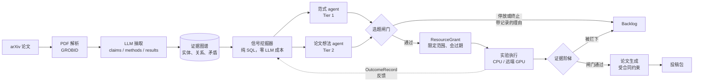
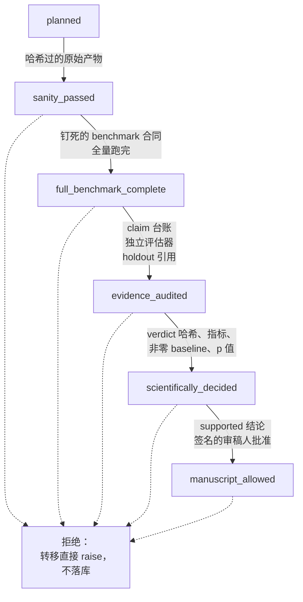
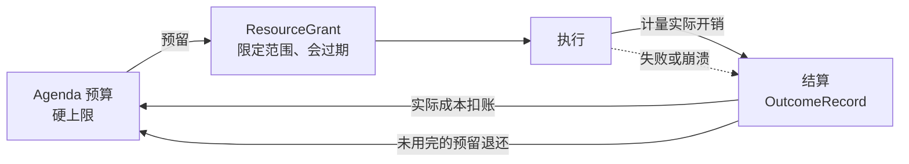

<div align="center">

# DeepGraph

**一个开放的科研引擎：规模化地读文献，把它变成结构化的证据图谱，
并把有希望的方向推进到有合同、有预算、可审计的实验。**

`Python 3.12+` &nbsp;·&nbsp; `PostgreSQL` &nbsp;·&nbsp; `CPU / 远端 GPU` &nbsp;·&nbsp; `Apache-2.0`

[English](README.md) &nbsp;·&nbsp;
[部署](docs/DEPLOY.md) &nbsp;·&nbsp;
[成果展示](docs/SHOWCASE.md) &nbsp;·&nbsp;
[路线图](docs/ROADMAP.md)

</div>

---

## 设计原则：The Bitter Lesson

Rich Sutton 的 *The Bitter Lesson* 指出：回看 AI 七十年，能随算力扩展的通用方法，
最终都会超过依赖人工编码知识的方法。DeepGraph 把这句话当作架构约束而不是口号，
系统之所以长成现在这样，原因就在这里：

- **核心是通用搜索，不是专家启发式的集合。** 研究候选来自一个扫遍全图的廉价 SQL
  信号挖掘器加上通用的想法生成 agent，而不是人工整理的选题清单。扩大论文语料和
  算力预算，搜索面直接变宽。
- **人工领域知识被隔离。** 领域执行器和方法别名放在可选插件里
  （`plugins/examples/cggr/`）。按设计，任何人工编写的领域 agent 都拿不到独立的预算
  权限，所以专用代码永远不可能悄悄变成决定资源去向的东西。
- **策略可以被学习替换。** 当前的组合决策策略是一个刻意保持透明的 best-of-N 启发式，
  记录输入、置信区间和机会成本；它的结构就是为了在积累足够 `OutcomeRecord` 之后，
  能换成受约束的 contextual bandit 或 Thompson 采样（见 `docs/internal/ARCHITECTURE.md`）。
- **用反馈，不用打补丁。** 失败应当被通用的"运行—观察—修复"循环吸收，并作为
  outcome record 回灌，而不是在代码里再加一个特例分支。
- **算力是被预算化的基本单位。** 每一笔开销都要先预留、再计量、最后对着 agenda
  预算结算，这才让"把算力加上去"是一个受控操作，而不是打开水龙头。

规模化的搜索只有在"判断什么是真的"这个筛子同样能规模化时才划算。那个筛子就是下面的
证据阶梯，它是这套系统的另一半。

---

## 系统在做什么



1. **摄取** —— arXiv 发现、PDF 解析、用 LLM 把 claims / methods / results / taxonomy
   抽成结构化数据写入 PostgreSQL。
2. **建图** —— 跨论文合并实体、关系、矛盾与证据链接，做实体消歧和领域摘要。
3. **发现** —— 零 LLM 成本的 SQL 信号挖掘器找出重叠、汇聚模式、矛盾簇和性能平台期；
   范式 agent 与论文想法 agent 把这些信号变成可执行的研究候选。
4. **执行** —— 过闸的候选拿到限定范围的资源授权、冻结的 benchmark 合同，
   然后在 CPU 或远端 GPU 上运行。
5. **成稿** —— 受合同约束的论文生成：claim-证据矩阵、审稿模拟、图表与版式审计、
   PDF 完整性检查。

---

## 差异化在哪里

多数自动科研系统把"任务跑完了"当成"结果是真的"。DeepGraph 建立在相反的前提上，
这套纪律就是它的核心创新。

### 1. 带内容哈希闸门的证据阶梯

结论每次只能往上爬一级，每一级都要求哈希过的原始产物、钉死的 benchmark 合同
和独立评估。证据不齐的转移不会被记成一次失败，而是直接拒绝——阶梯因此不会漂移
（`meta_harness/evidence_state.py`）。



### 2. 两本账，永不混写

"它跑了没有"和"审计过的证据说了什么"分开存储、分开提供、分开显示，一直贯彻到
界面上的两个徽章。一个运行状态为 `completed` 的任务，在证据另有说法之前，
科学状态始终是"未评估"。系统没有办法把过程包装成证明。

| 账簿 | 回答的问题 | 词汇 |
|---|---|---|
| **运行账** (`RUN`) | 任务执行了吗？ | `planned`、`running`、`completed`、`failed`、`cancelled` |
| **科学账** (`EVIDENCE` / `DECIDED`) | 审计过的证据说了什么？ | `not assessed`、`sanity_passed`、`full_benchmark_complete`、`evidence_audited`、`decided`、`manuscript_allowed` |

### 3. 用比特给"入场"定价的选题闸门

候选在花掉任何资源之前，必须带着预先登记的预测；预期信息增益随后由一个纯函数
算出——不调 LLM、不查数据库，也没有任何开关能把它关掉（`agents/topic_gate.py`）。
没过闸的候选会被停放或终止，**并且带着记录在案的理由**，所以一次拒绝是可审计的，
而不是无声无息的。

### 4. 授权经济学：预留、计量、结算



没有授权就不能运行，失败结算得和成功一样诚实——一个只会给赢家结账的系统，
在任何账目上都不值得信任。

### 5. 会说"不"的论文闸门

一条论文 claim 必须能追溯到冻结的合同、完整的证据清单、多 seed 统计和签名的
审稿人批准，才能拿到 `manuscript_allowed`（`contracts/scientific_evidence.py`、
`agents/paper_completeness.py`）。没过质量闸门的稿件包会被盖上 `DO_NOT_SUBMIT.md`
并附上具体修复清单，而不是被发出去。

### 6. 把运维也写进合同

SHA 钉死的部署清单、只增不改的数据库迁移、每个 tick 最多做一个动作的自愈看门狗，
以及只读的审计脚本（`orchestrator/selfheal_policy.py`、`deploy/`）。

---

## 运行规模

2026-08-07 从线上 `/api/stats` 取的运行快照：

| | |
|---|---|
| 论文 | 收录 21,677 篇，完整处理 6,729 篇 |
| 结构化证据 | 28,700 条 claims、156,194 条 results、238 个矛盾簇 |
| 知识图谱 | 248,441 个实体、735,913 条关系、5,051 个 taxonomy 节点 |
| 发现层 | 11,936 条 insights、110 条 deep insights、25,652 个机会点 |
| 执行层 | 115 次实验运行、99 个 GPU job、17 个已注册 worker |
| 投入 | 9.21 亿 LLM token |

演示路线与案例：**[docs/SHOWCASE.md](docs/SHOWCASE.md)**。

---

## 快速开始

最低要求是 Python 3.12+ 和一个 LLM API key；接上 PostgreSQL 才能启用完整控制平面。

```bash
python3.12 -m venv .venv
source .venv/bin/activate
pip install -r requirements.txt
cp .env.example .env    # 至少要设 DEEPGRAPH_LLM_API_KEY
export $(grep -v '^#' .env | xargs)
python3.12 main.py
```

打开 `http://localhost:8080`。

完整部署（PostgreSQL 迁移、systemd、远端 GPU 后端、配置参考）：
**[docs/DEPLOY.md](docs/DEPLOY.md)**。

---

## 仓库结构

| 目录 | 用途 |
|---|---|
| `contracts/` | 带版本的记录类型及其校验规则 |
| `meta_harness/` | 控制平面：证据阶梯、授权、权限、仓储 |
| `ingestion/` | arXiv 发现与 PDF 解析 |
| `agents/` | 抽取、想法生成、闸门、实验编排 |
| `db/` | schema、迁移、taxonomy、证据图谱、实体消歧 |
| `orchestrator/` | 调度、worker、自愈策略、算力运行时 |
| `web/` | Flask API、溯源 API、Dashboard |
| `deploy/` | systemd 单元、Caddyfile、部署清单 |
| `scripts/` | 运维 CLI、审计、迁移、清单工具 |
| `plugins/` | 自包含的实验 harness，例如 `examples/cggr` |
| `tests/` | 90 个测试模块 |

## 文档

| 文档 | 内容 |
|---|---|
| [docs/DEPLOY.md](docs/DEPLOY.md) | 完整部署：数据库、systemd、GPU 后端、配置 |
| [docs/SHOWCASE.md](docs/SHOWCASE.md) | 实时数字、演示路线、案例 |
| [docs/ROADMAP.md](docs/ROADMAP.md) | 下一步计划 |
| [docs/upgrade-plan-v1-v2.md](docs/upgrade-plan-v1-v2.md) | V1 到 V2 升级计划 |
| [LATENT_COMMUNICATION_RESEARCH.md](LATENT_COMMUNICATION_RESEARCH.md) | 团队的潜空间通信研究线 |
| `docs/internal/` | 运维 runbook、状态字典、配置与架构参考 |

版本历史：[CHANGELOG.md](CHANGELOG.md)，单独维护。

## 测试

```bash
python3.12 -m unittest discover -s tests
```

只读审计脚本，可以直接对线上部署跑：

```bash
python3.12 scripts/meta_harness_scope_audit.py
python3.12 scripts/meta_harness_sql_audit.py
python3.12 scripts/meta_harness_static_audit.py
```

## 数据与安全

- 代码里没有硬编码凭据；密钥以**引用**形式从环境注入，不存明文。SSH 执行强制
  known-host 钉定。
- 公开 API 响应经过一层擦除器，剥掉路径和日志类字段并抹掉绝对路径；SSE 流走同样的
  擦除（`web/app.py:84-106`）。
- 每一个无参数 GET 路由都被一个防泄漏测试遍历，断言响应体里不出现文件系统路径或
  日志尾巴（`tests/test_provenance_web.py:282`）。

## 许可证

见 [LICENSE](LICENSE)。
