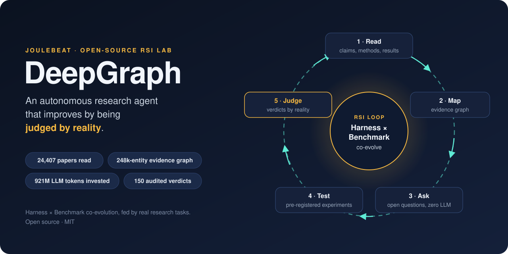

<p align="center">
  
</p>

<p align="center">
  <b>开源 RSI 实验室 JouleBeat 的自主科研 Agent。</b><br>
  读文献、找问题、跑实验，由现实裁决什么是真的。
</p>

<p align="center">
  <a href="https://deepgraph.joulebeat.com">官网</a> ·
  <a href="docs/RESULTS.md">实测结果</a> ·
  <a href="docs/SHOWCASE.md">案例</a> ·
  <a href="docs/ARCHITECTURE.zh-CN.md">架构</a> ·
  <a href="README.md">English</a>
</p>

<p align="center">
  
  
  
</p>

---

## 为什么做 DeepGraph

**JouleBeat 让 Harness 和 Benchmark 一起进化，以此构建持续自我改进的 AI。**

Agent 怎么干活（它的 Harness：工具、记忆、工作流、验证方式）对能力的影响已经能达到一代模型的量级，而开源让 Harness 变体可以批量生成。真正稀缺的是能分清"真进步"和"碰巧高分"的 Benchmark。所以我们把两者都放进回路：Harness 在 Benchmark 下竞争，Benchmark 按它对后续真实结果的预测准不准来竞争。

这个回路需要源源不断、答案可检验的真实任务。计算科研正是这样：一个结论能被可复跑的代码、没参与挑选的数据或一次独立重算证实或证伪，周期从几分钟到几天。**DeepGraph 就是这些任务的来源。**

- **对科研工作者**，它是交付可检验结论的科研 Agent。
- **对我们**，它是自身研发的加速器：每个任务都是对下一代 Harness 和 Benchmark 的一次裁决。

## 它怎么工作

| | 步骤 | 做什么 |
|:-:|---|---|
| 1 | **读** | 规模化抓取 arXiv，抽取论点、方法和结果 |
| 2 | **连** | 合并成实体、关系和矛盾组成的证据图谱 |
| 3 | **问** | 十个结构探测器用纯 SQL 找出开放问题，路径上不经过 LLM |
| 4 | **试** | 把问题变成预注册、有预算的实验，在 CPU 或 GPU 上执行 |
| 5 | **判** | 证据阶梯只在比较公平时给出结论，结果反过来决定下一轮搜什么 |

每个结论都可审计，系统也审计自己：2026 年 8 月，它查出并撤回了 11 条建立在空输出上的自家结论。一个搜索回路的上限，取决于判断"什么是真的"那道筛子。详见[实测结果](docs/RESULTS.md)。

## 一眼看懂

生产环境实时数据，2026 年 8 月。

| | |
|---|---|
| 论文 | 抓取 24,407 篇，7,005 篇走完完整证据管线 |
| 证据图谱 | 248,441 个实体，735,913 条关系，238 个矛盾簇 |
| 发现 | 25,652 个已定位的研究机会 |
| 实验 | 6 个研究方向上 150 条经审计的结论 |
| 投入 | 9.21 亿 LLM token |

## JouleBeat 技术栈

| 层 | 是什么 | 状态 |
|---|---|---|
| **DeepGraph** | 科研 Agent：真实任务进，可检验结论出 | 在服务中，已有课题组付费 |
| **Harness × Benchmark 库** | 带版本的 Harness；按"事前预测是否被后续结果证实"打分的 Benchmark | Harness 版本管理已运行；Benchmark 检验建设中 |
| **[Evolution Kernel](https://github.com/Protocol-zero-0/evolution-kernel)** | 引擎：提出、评估、接受或回滚 | 已开源，`pip install evolution-kernel` |

## 快速开始

最低要求是 Python 3.12+ 和一个 LLM API key；接上 PostgreSQL 才有完整控制面。

```bash
python3.12 -m venv .venv && source .venv/bin/activate
pip install -r requirements.txt
cp .env.example .env    # 至少设置 DEEPGRAPH_LLM_API_KEY
export $(grep -v '^#' .env | xargs)
python3.12 main.py      # 打开 http://localhost:8080
```

完整部署（PostgreSQL、systemd、远端 GPU）：[docs/DEPLOY.md](docs/DEPLOY.md)。

## 了解更多

- [架构](docs/ARCHITECTURE.zh-CN.md)：设计原则、回路、证据闸门、仓库结构、测试
- [实测结果](docs/RESULTS.md)：所有实测数字，直接读自生产数据库
- [案例](docs/SHOWCASE.md)：演示路线与案例
- [路线图](docs/ROADMAP.md)

## 参与

科研工作者：在 [deepgraph.joulebeat.com](https://deepgraph.joulebeat.com) 提交一个计算类问题。开发者：欢迎 issue 和 PR，贡献适用 [CLA](CLA.md)。

## 许可证

[MIT](LICENSE)
