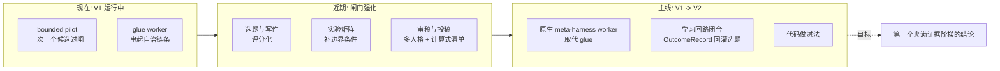

# Roadmap

> 中文导读: 下一步计划分三层: 正在推进的执行方式, 近期工程强化点, 和 V1 -> V2
> 升级主线。

## How work moves today

Research candidates advance one at a time through the gated pipeline: topic
gate -> portfolio decision -> resource grant -> bounded execution -> settlement
-> evidence ladder (`scripts/run_bounded_pilot.py`,
`orchestrator/bounded_execution.py`). The near-term goal is the first
candidate to climb the full evidence ladder to a scientifically decided,
manuscript-ready result.

## Near-term engineering

Strengthenings of the existing gate system, each scoped and independent:

- Scored title/abstract critique (memorability, quantitative claims,
  contribution specificity) on top of the existing rewrite-and-ban checks
- A negative/boundary-condition slot in the standard experiment plan,
  alongside main comparison, ablation, sensitivity, and cost
- Baseline budget-parity verification with an explicit stated-differences
  record, upgrading today's presence checks
- A multi-persona manuscript review loop (method skeptic, rigor reviewer,
  clarity/positioning reviewer) unifying the current independent review stages
- Revision diffs classified by what changed (claim / evidence / objection
  addressed), on top of the existing revision history and auto-revert
- A submission checklist computed from audit results, extended with ethics,
  artifact-availability, and reproducibility items
- Overfull-box scanning added to the PDF sanity pass
- A populated reference-paper corpus on the deployment host so corpus-based
  style audits run at full strength

## Main line: V1 -> V2

The current deployment (V1) connects the autonomous chain with glue workers.
V2 replaces the glue with native meta-harness workers and retires
transitional code -- the full plan, including the code-subtraction targets,
is maintained in [upgrade-plan-v1-v2.md](upgrade-plan-v1-v2.md).

The highest-leverage item there is the **learning loop**: outcome records and
failure clusters feeding back into candidate ranking and forge prompts, so the
system improves with use rather than plateauing on hand-written knowledge --
the Bitter Lesson commitment described in the [README](../README.md) applied to
the one place it is not yet closed.

## Compute

- Scale the verified SSH GPU fleet; every new GPU model enters through a
  recorded canary before scheduling (`DEEPGRAPH_COMPUTE_VERIFIED_BACKENDS`)
- Adapter work to admit additional backend types into the same
  grant-and-canary discipline
