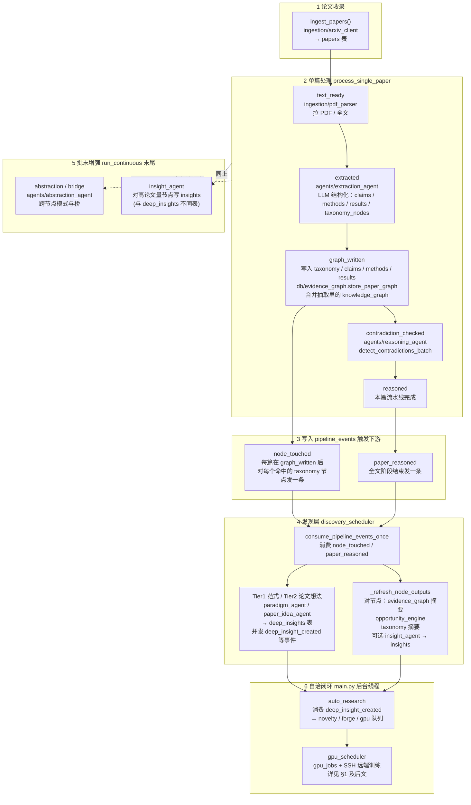

# 云 GPU（SSH 远端）与编排系统：痛点与调试交接说明

> 读者：来支援的工程师（运维 / 后端 / ML）。  
> 目标：先用 **§0** 把「读论文 → 进图谱 → 触发发现 → 深度洞察 → 自动实验」整条流水线讲清楚；再写「repo 同步到远端 GPU 跑」的痛点，并补充**全系统其它已暴露风险**，便于环境、调度、数据与可观测性一并调稳。

---

## 0. 研究流水线与图谱触发（DeepGraph 在「干什么」）

这一节回答：**论文从哪来 → 怎么进库 → 图谱怎么长出来 → 谁消费这些信号继续往下游（深度洞察 / 自动研究 / 实验）**。实现主路径在 `orchestrator/pipeline.py` 与 `orchestrator/discovery_scheduler.py`；事件总线在 DB 的 **`pipeline_events`**（通过 `db.emit_pipeline_event` / `fetch_pipeline_events`）。

### 0.1 端到端流水线（逻辑图）

**图谱是在哪一步「被触发」的？**

- **结构化写入**：在 **`graph_written`** 阶段把抽取结果落到关系库，并调用 **`db/evidence_graph.py`** 把本篇的实体/边合并进证据图；同时对每个 **`paper_taxonomy`** 命中的节点发 **`node_touched`**。  
- **增量刷新**：**`discovery_scheduler`** 读到 **`node_touched` / `paper_reasoned`** 后，对受影响节点做 **`_refresh_node_outputs`**（重算图摘要、机会点、taxonomy 摘要等），并可能再产出 **`deep_insights`** 与对应 **pipeline 事件**，供 **`auto_research`** 接手。

**和「insights」表的区别（避免读库读错）**

- **`insights`**：偏 **taxonomy 节点级**、批末/增量 `insight_agent` 写入（`pipeline.py` 里 `_run_incremental_insights` 等路径）。  
- **`deep_insights`**：偏 **研究假设 / 可实验化候选**，由 **范式或论文想法发现** 等路径写入；**`auto_research` 主要跟这条线**。

### 0.2 运行时部署（和上面流水线正交）

- **单进程 `main.py`**：`Waitress/Flask` 提供 Web；同进程内还有 **`auto_research`**、**`gpu_scheduler`** 等后台线程（见 `main.py`）。  
- **PostgreSQL**：论文、图谱、事件、`deep_insights`、`gpu_*`、实验 run 等的主存储。  
- **IDEA 工作区目录**：forge/实验/稿件等大文件在 `IDEA_WORKSPACE_DIR`（常为 `deepgraph_ideas/idea_*`）。  
- **`GPU_MODE=ssh`** 时：**训练算力在 SSH 远端**；控制面机器上 **`nvidia-smi` 无占用是正常现象**（详见 §1）。

---

## 1. 架构先对齐（否则容易误判）

- **控制面**：DeepGraph 主服务跑在一台**通常没有 NVIDIA GPU**的机器上（编排、PostgreSQL、Web 等）。
- **算力面**：`DEEPGRAPH_GPU_MODE=ssh` 时，训练在 **SSH 可达的远端 GPU 机器**上执行；本地库里的 `gpu_jobs.status=running` **不等于**控制面机器上有 GPU 占用。
- **执行路径（概念）**：
  1. 本地 `experiment_runs.workdir` 经 **rsync** 同步到远端目录（默认在 `DEEPGRAPH_GPU_REMOTE_BASE_DIR` 下按 `run_<id>` 组织）。
  2. 远端 `bash` 内设置 `CUDA_VISIBLE_DEVICES`，再跑 `baseline_command` / 默认 `python <train>.py`。
  3. 结束后 **rsync 回拉** 工作区（日志、产物等）。

不理解这一点时，常见误判是：**「服务器 nvidia-smi 没动静 → 调度坏了」**，实际上 GPU 在另一台（或同一台但你看的不是 SSH 目标机）。

---

## 2. 已观察到的核心痛点（按优先级）

### 2.1 远端 Python 环境「空壳」：进程秒崩，GPU 显存几乎为 0

**现象**

- 远端 `nvidia-smi` 能看到卡（例如 L40S），显存占用却接近 **0～几 MiB**。
- 本地 `run.log` 里常见 **`ModuleNotFoundError`**（例如缺 `transformers`、`open_clip`），训练在 **import 阶段**就退出，根本进不了 CUDA 计算。

**根因**

- 同步过去的是 **git 源码树**，不等于远端已 `pip install` 成可运行环境。
- 默认远端解释器常是系统 `python`，没有项目依赖。

**代码侧已做的缓解（需工程师确认是否开启、超时是否够）**

- `orchestrator/ssh_gpu_backend.py`：SSH 训练前可选执行依赖安装（`pyproject.toml` / `setup.py` → `pip install -e .` 等）。
- 配置项：
  - `DEEPGRAPH_GPU_REMOTE_AUTO_PIP_INSTALL`（默认 `true`）
  - `DEEPGRAPH_GPU_REMOTE_SETUP_TIMEOUT_SECONDS`（默认 `3600`，首次装 `torch` 可能仍不够，需按镜像/网络调大）

**仍建议的「正确工程解」**

- **用预装 CUDA/torch 栈的镜像或 conda**，把 `DEEPGRAPH_GPU_REMOTE_PYTHON` 指到该环境；生产环境建议 **`DEEPGRAPH_GPU_REMOTE_AUTO_PIP_INSTALL=false`**，避免每次冷启动在线编译/下载导致不稳定。

---

### 2.2 控制面重启 / 线程中断 → DB 里「僵尸 running」

**现象**

- `gpu_jobs` 长期 `running`，但 `experiment_iterations` **长时间为 0**（或明显不增长）。
- `gpu_workers` 可能已回到 `idle`，与控制面认知不一致。

**根因**

- GPU 调度在后台线程里跑；**进程重启**或异常退出时，可能出现 **DB 状态没收尾** 的中间态。

**已做的缓解**

- `orchestrator/gpu_scheduler.py`：对「抢占 worker + 选 job + `thread.start()`」加了 **`_job_dispatch_lock`**，降低并发启动抢同一 idle worker 的概率。

**仍建议的工程解**

- 增加 **running 超时自愈**（按 `gpu_jobs.timeout_s` + grace，把卡死 job 打回 `queued` 或 `failed` 并写清原因）。
- 增加 **SSH 探活 / worker heartbeat**（长任务期间也要更新心跳，否则无法区分「真在跑」与「挂了」）。

---

### 2.3 训练入口写错 / 占位路径 → 误判「有 repo 但没入口」

**现象**

- `main_train_file` 写成根目录 `train.py`，但真实入口在 `src/train.py` 等；review 侧可能把实验打成 smoke-only 或反复失败。

**已做的缓解**

- `agents/experiment_forge.py`：`repair_codebase_entrypoint()` 会在克隆目录上 **启发式修正**常见 `train.py` 路径。

**仍可能出问题的场景**

- 多入口、非标准布局、需要 `llamafactory-cli` 而非裸 `python train.py` 的项目；需要 **项目级约定**或 **proxy 里显式 baseline_command**。

---

### 2.4 云 GPU「会挂」的本质：任务级 checkpoint 缺失时只能重跑

**现象**

- 远端实例回收、SSH 断连、磁盘满、依赖安装半道失败 → 一次长跑直接浪费。

**根因**

- 编排器当前更偏「每次迭代落库」，但 **训练框架内部 checkpoint** 与 **编排器级 resume** 是否完备，取决于具体 repo 与 loop 实现；并非所有失败都能无损续跑。

**工程上可演进方向**

- 训练侧：强制输出 checkpoint（HF/LLaMA-Factory 等各自最佳实践）。
- 调度侧：对 **可重试错误**（SSH timeout、connection reset 等）做 **有限次数自动重试**，并明确区分「永久失败」与「瞬时失败」。

---

## 3. 给其他工程师的「最短调试清单」

1. **确认 SSH 目标机**：`gpu_jobs.assigned_worker`、`gpu_workers.metadata` 里的 `ssh_host` / `ssh_port` / `ssh_user`（**不要把密码写进文档或日志样本**）。
2. **看本地 `run.log`**：`{workdir}/run.log`（远端 stdout/stderr 会汇总到这里）。重点搜：`ModuleNotFoundError`、`CUDA`、`timeout`、`rsync`。
3. **对照 DB**：
   - `gpu_jobs`：`queued | running | completed | failed` 与时间戳。
   - `experiment_iterations`：是否在增长（判断「真在跑」还是「卡死在同步/安装/首步」）。
4. **在 SSH 目标机上**（不是控制面）：
   - `nvidia-smi` 持续观察（注意训练可能长时间处于 **数据准备/CPU 预热**，短时 0 占用不一定异常）。
   - 手动进入远端 `remote_base_dir/runs/run_<id>/code` 尝试同一条启动命令复现。

---

## 4. 相关代码位置（方便直接跳读）

| 主题 | 路径 |
|------|------|
| SSH 同步 + 远端执行 + 依赖预装 | `Deepgraph/orchestrator/ssh_gpu_backend.py` |
| GPU 队列、job 生命周期 | `Deepgraph/orchestrator/gpu_scheduler.py` |
| 何时走 SSH worker | `Deepgraph/agents/validation_loop.py`（`execution_context` + `ssh_gpu_backend.is_ssh_worker`） |
| 入口点修复 / forge | `Deepgraph/agents/experiment_forge.py` |
| GPU 相关环境变量默认值 | `Deepgraph/config.py`（`DEEPGRAPH_GPU_*`） |

---

## 5. 建议的「支援工程师交付标准」（验收口径）

- [ ] SSH 目标机上用 **`DEEPGRAPH_GPU_REMOTE_PYTHON`** 一键 `import` 关键依赖（如 `torch`、`transformers`）无报错。  
- [ ] 一次完整 `gpu_job`：`running → completed/failed` 状态闭环，**不出现长时间 `running` 且 iterations 不增长**（或出现时有明确告警/自愈）。  
- [ ] `run.log` 中能看到 **REMOTE_EXECUTOR / CUDA_VISIBLE_DEVICES / nvidia-smi 采样**（便于确认远端真执行）。  
- [ ] 生产环境默认 **不依赖**「每次冷启动在线 pip 装全套」；改为镜像/conda。  
- [ ] 文档化：**单 worker 并发策略**、**最大重试**、**running 超时**（若已实现则指向配置项）。

---

## 6. 系统其他已知问题与风险（不仅云 GPU）

> 本节汇总当前架构下**已暴露或高概率踩到**的问题，便于支援工程师一并消化；其中部分已在代码里缓解，但未做到「可完全忽略」。

### 6.1 数据库：PostgreSQL 运行时旁路仍存在 legacy SQLite 文件

**现象**

- 日志里反复出现：`legacy SQLite file still exists ... but runtime is using PostgreSQL`。

**风险**

- 新人或脚本若误读 `Deepgraph/deepgraph.db`（或仓库内其它 SQLite 路径），会得到**与生产不一致**的结论，排障方向跑偏。

**建议**

- 运维层：将遗留 SQLite **归档、改名或移出仓库路径**，并在部署文档中明确 **唯一真源为 `DEEPGRAPH_DATABASE_URL`**。

---

### 6.2 连接与事务：曾观察到 Postgres `idle in transaction`

**现象**

- `ps` 中出现 `idle in transaction` 会话与主进程同时存在。

**风险**

- 长事务可能拖住锁、膨胀 WAL、让调度/写入偶发卡顿；极端情况下与后台线程的异常路径叠加，放大「状态不一致」感受。

**建议**

- 排查：应用侧是否在异常路径漏了 `commit/rollback`；是否需要 **更短的事务边界** 或 **连接池**（视当前 `db/database.py` 用法而定）。  
- 监控：对 `idle in transaction` 时长设告警。

---

### 6.3 LLM 调用链：上游不稳定会拖垮 forge / scaffold 质量

**现象**

- 上游返回 **502/504**、触发 **cooldown**；`generate_scaffold` 走 fallback，表现为 **`scaffold_tokens=0`**、脚手架偏「模板化」。

**风险**

- 合同字段虽可 autofilled，但 **program/evaluate** 质量下降 → 后续实验更难一次跑通；与「云 GPU 无关」但会叠加成「整条链路都不顺」。

**建议**

- 多 provider / 重试策略（已有部分）+ **熔断时的显式 job 状态**（例如 `forge_degraded`），避免静默低质量产物。  
- 对关键路径设 **超时与可观测指标**（按 insight/run 维度打点）。

---

### 6.4 编排：`review_pending`、DB 与磁盘工作区不一致（历史债）

**现象（典型）**

- `auto_research_jobs` 卡在 `review_pending`；DB 里 `workdir` / `proxy_config` 为空，但磁盘上 `deepgraph_ideas/.../experiment/runs/run_*` **已有 code/**。

**根因（概念）**

- `forge`/长任务中途被中断、或缺少足够细的 **checkpoint 回写** 时，会出现「磁盘已 clone、DB 仍半成品」。

**已做的缓解（方向）**

- `experiment_forge` 中增加分阶段 `_checkpoint_run_state`；`auto_research` 侧对 scaffold ready 判定收紧等（具体以当前分支代码为准）。

**仍建议**

- 增加 **自愈任务**：周期性扫描「磁盘存在 + DB 缺关键字段」的 run 并续跑/打标，避免靠人工 SQL。

---

### 6.5 实验失败形态：`scaffold_ready` 阶段失败堆积

**现象（曾在库表统计中出现）**

- 多条 `experiment_runs` 处于 `failed` 且 `phase=scaffold_ready`。

**可能原因**

- 依赖/入口/LLM 产物不合格、环境 scout 未通过、或下游假设与真实 repo 结构不匹配。

**建议**

- 为每条 failed run 固化 **结构化 `error_message`**（分类：deps / entrypoint / LLM / policy），并做 **聚合报表**（按 repo、按 insight 模板），便于批量修。

---

### 6.6 `auto_research_jobs` 的 `blocked`：不一定是「系统坏了」

**现象**

- 存在多条 `status=blocked`（例如 prior work、审查策略拦截等）。

**说明**

- 这可能是**产品语义上的终态**，需要与「异常卡死」区分；支援工程师应先读 `stage` / `last_note` 再决定是否要「解阻塞」。

---

### 6.7 进程模型：`main.py` 单实例锁

**行为**

- 第二个 `main.py` 会因锁直接退出（防重复调度、抢端口、抢 DB）。

**运维注意**

- 属于**刻意设计**；若 CI/手滑双启，会表现为「服务没起来」——先查是否已有实例与锁文件策略。

---

### 6.8 安全：`gpu_workers.metadata` 可能含 SSH 密码明文

**风险**

- 为便于 `SSH_ASKPASS`，worker 元数据里可能带有 **ssh_password**；数据库备份、日志导出、截图交接时容易 **无意泄露**。

**建议**

- 长期：改为 **密钥登录** 或 **短时 token**，密码不进库；短期：限制 DB 访问、脱敏备份、文档/工单禁止贴 metadata 原文。

---

### 6.9 可观测性：`run.log` 在单次远端 SSH 返回前可能不存在

**现象**

- 长 rsync / 长 pip / 远端训练未结束时，本地 `run.log` 尚未生成或不变，排障者误以为「没跑到远端」。

**建议**

- 在 SSH 包装脚本里增加分阶段 `echo` 到 stdout（已部分有 `REMOTE_EXECUTOR`）；或本地先建 **空 `run.log` + heartbeat 追加**。

---

### 6.10 依赖安装策略与资源争抢

**现象**

- `DEEPGRAPH_GPU_REMOTE_AUTO_PIP_INSTALL=true` 时，**首次**或**大包**安装耗时长；若多台 job 指向同一远端、同一用户 site-packages，可能出现 **pip 锁/并发写** 或 **IO 打满**。

**建议**

- 生产：**镜像预装 + 关闭自动 pip**；或 **每 job 独立 venv**（路径级隔离）。

---

### 6.11 代码卫生（低优先级但真实存在）

- `orchestrator/auto_research.py` 等路径存在 **`datetime.utcnow()` 弃用告警**（Python 3.12+ 趋势），建议逐步改为 **timezone-aware UTC**。  
- 部分异常路径标注 `pragma: no cover`，意味着 **生产异常依赖日志与指标**，单测覆盖不足。

---

## 7. 变更记录（便于对齐版本）

- **2026-04-22**：初版（云 GPU SSH 链路痛点 + 调试清单 + 验收标准）。  
- **2026-04-22**：增补 **§6 系统其他已知问题**（DB/SQLite 旁路、事务、LLM、forge 一致性、失败堆积、blocked 语义、单实例锁、密钥落库、可观测性、pip 争抢、代码卫生等）。  
- **2026-04-22**：**§0 改为「研究流水线与图谱触发」**（Mermaid：ingest → process_single_paper → pipeline_events → discovery_scheduler → auto_research；§0.2 简述运行时部署）。此前仅部署拓扑的图已替换。  
- 背景（仍适用）：控制面无本地 GPU、`GPU_MODE=ssh`、远端依赖缺失、进程重启导致 `gpu_jobs` 僵尸 `running`；同期代码侧已加入 **远端自动 pip 安装** 与 **GPU job 派发锁**（详见上文路径表）。
