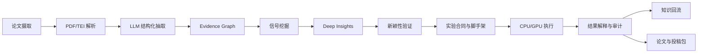

# DeepGraph 项目展示 PPT 内容稿

数据快照来源: 本机 `http://127.0.0.1:8081/api/stats`，采集时间 2026-06-22。正式展示前建议再刷新一次数据。

建议页数: 18 页。主线为: 项目背景 -> 创新点 -> 具体设计方案 -> 效果展示。

---

## 01. 封面

# DeepGraph: 面向科研发现的证据图谱与自动实验闭环

副标题: 从论文摄取、结构化证据、研究假设到实验验证与论文产出

讲解要点:
- DeepGraph 不是单纯的论文搜索或总结工具。
- 它试图把科研流程中的四个关键动作串起来: 读文献、发现空白、提出假设、验证并沉淀结果。

画面建议:
- 使用系统 Dashboard 首页、架构图或 Agent Office 截图作为视觉背景。

---

# 第一部分: 项目背景

---

## 02. 科研发现的现实痛点

核心观点: 当前科研信息量巨大，但“从读到发现、从发现到验证”的链路仍然高度人工化。

页面内容:
- 文献爆炸: 研究者需要持续跟踪大量论文、方法、数据集和实验结论。
- 信息碎片化: claims、methods、results、limitations 分散在论文自然语言中，难以直接比较。
- 发现链条断裂: 现有工具多停留在检索、摘要或问答，难以自动进入实验验证和论文产出。
- 可信性不足: LLM 可以生成想法，但如果没有证据追踪和实验审计，很容易产生不可验证的“灵感”。

讲解要点:
- 科研真正难的不是“写一段总结”，而是把证据、假设、实验和结论连成可审计闭环。

---

## 03. 现有方案的不足

核心观点: 文献工具、知识图谱和科研 Agent 各自有价值，但单独使用时都不完整。

页面内容:

| 方案 | 能解决什么 | 主要缺口 |
| --- | --- | --- |
| 文献检索/摘要工具 | 找论文、读摘要、做问答 | 缺少结构化证据和跨论文推理 |
| 静态知识图谱 | 组织实体和关系 | 难以自动转成可验证研究假设 |
| 单体科研 Agent | 能生成方案和代码 | 证据来源、实验合同、失败状态难以治理 |
| 手工实验流程 | 结果相对可靠 | 成本高、周期长、难以规模化探索 |

讲解要点:
- DeepGraph 的目标不是替代某一个环节，而是打通这些环节之间的接口和状态。

---

## 04. DeepGraph 的项目定位

核心观点: DeepGraph 是一个从文献地图走向主动科研发现的系统。

页面内容:
- 输入: arXiv 论文、PDF 全文、本地参考论文、已有实验结果。
- 中间层: Evidence Graph，沉淀实体、关系、claims、results、contradictions 和 taxonomy。
- 发现层: 从图谱信号中生成跨领域 insight 和可执行 paper idea。
- 验证层: 将 idea 转为 benchmark contract、实验脚手架、CPU/GPU run 和结果审计。
- 输出: Dashboard、研究提案、实验 artifact、论文草稿和投稿 bundle。

一句话:
- DeepGraph 希望回答三个问题: 这个领域在做什么、还有什么没解决、下一步应该试什么。

---

# 第二部分: 创新点

---

## 05. 创新点一: Evidence Graph 科研记忆底座

核心观点: 把论文自然语言转化为可查询、可聚合、可追踪的证据网络。

页面内容:
- 从 PDF 中抽取 claims、methods、results、datasets、metrics、limitations。
- 将实体和关系写入 Evidence Graph，支持跨论文聚合和实体消歧。
- 通过 taxonomy 将论文归入研究主题树，形成领域地图。
- 支持矛盾检测、证据稀疏区识别、方法-数据集矩阵和 opportunity briefs。

当前数据快照:
- 论文总数: 1,360，已处理: 1,315
- Claims: 19,167，Results: 32,549
- Taxonomy nodes: 1,040
- Graph entities: 66,156，Graph relations: 129,771

画面建议:
- 展示 Explore Map 或 Evidence Matrix 页面截图。

---

## 06. 创新点二: 图谱信号驱动的研究发现

核心观点: DeepGraph 不只总结已有论文，还从结构化信号中主动生成研究方向。

页面内容:
- Signal Harvester: 用低成本 SQL 信号发现重叠、矛盾、性能平台期和证据空白。
- Tier 1: Paradigm Agent，寻找远距离领域之间的结构同构和范式迁移机会。
- Tier 2: Paper Idea Agent，生成可实验化、面向论文的具体研究想法。
- Novelty Verifier: 对新 idea 做文献新颖性检查，降低重复工作风险。
- Meta-learner: 根据实验结果回调发现策略，形成长期自改进。

当前数据快照:
- Insights: 5,805
- Deep Insights: 110，其中 Tier 1 为 75，Tier 2 为 35
- Node opportunities: 5,423

---

## 07. 创新点三: 从想法到实验再到论文的闭环

核心观点: DeepGraph 把科研 idea 转成可执行实验，而不是只输出文本建议。

页面内容:
- Experiment Forge: 将 idea 转为实验合同、baseline、数据集、指标和代码脚手架。
- Validation Loop: 执行实验、记录每轮结果、保留改进、解释失败。
- GPU Scheduler: 支持本地/远程 GPU worker、任务队列、artifact 回收和健康检查。
- Result Interpreter: 将实验 run 转成结构化 verdict，并回写 graph 和 deep insight 状态。
- PaperOrchestra: 基于审计后的实验结果生成论文稿、图表、引用和投稿包。

当前数据快照:
- Experiment runs: 208，completed: 34
- Confirmed hypotheses: 28，refuted: 2
- GPU workers: 4，GPU jobs: 898
- Manuscript runs: 8，Submission bundles: 1

---

## 08. 创新点四: 论文级证据治理与质量闸门

核心观点: 系统不是“只要生成就算完成”，而是通过 contract 和 audit 控制可发表性。

页面内容:
- Benchmark contract: 冻结 dataset、model、baseline、seed、metric、预算和 artifact 要求。
- Claim register: 每条论文 claim 必须映射到具体证据 cell。
- Artifact audit: 检查 raw generations、metrics、CI、显著性、失败样本和预算。
- Manuscript gate: 稿件必须具备问题动机、方法机制、实验结果、限制和引用完整性。
- 失败也有价值: 被质量闸门拦下的稿件会留下 `DO_NOT_SUBMIT.md`、质量报告和修复建议。

讲解要点:
- 这套机制让自动科研系统从“会生成”走向“知道什么时候不能发表”。

---

# 第三部分: 具体设计方案

---

## 09. 总体架构

核心观点: DeepGraph 采用事件驱动的分层流水线。

讲解要点:
- 关键不是单个 agent，而是每个阶段都有状态、事件、artifact 和回写路径。

---

## 10. 数据层设计

核心观点: 数据层同时服务检索、图谱推理、实验回放和论文写作。

页面内容:
- `papers`: 论文元数据、处理状态、token cost。
- `claims/results/methods`: 单篇论文中的结构化科学陈述。
- `taxonomy/paper_taxonomy`: 研究领域层级和论文归属。
- `graph_entities/graph_relations`: 实体和关系图谱。
- `deep_insights`: 可验证研究假设和论文想法。
- `experiment_runs/gpu_jobs`: 实验执行状态、结果、日志、资源。
- `manuscript_runs/submission_bundles`: 论文生成状态和投稿产物。
- `pipeline_events`: 连接摄取、图谱刷新、发现、实验和稿件生成的事件总线。

画面建议:
- 用一张 ER 简图表现从 paper 到 insight 到 experiment 到 manuscript 的主链路。

---

## 11. Agent 分层与职责边界

核心观点: 系统按“大 agent 边界”组织，保证职责清晰、旧代码兼容。

页面内容:

| Big Agent | 职责 |
| --- | --- |
| Paper Extraction | 论文发现、PDF 解析、结构化抽取、source completeness |
| Graph Construction | Evidence graph、taxonomy、opportunity signal、feedback loop |
| Idea Generation | Insight 生成、排序、路由、新颖性验证 |
| Experiment Planning | Benchmark contract、实验脚手架、artifact 审计 |
| Experiment Execution | Validation loop、GPU job、远程 shard、health check |
| Manuscript Generation | 稿件、图表、引用、质量审计、投稿 bundle |
| Orchestration | 端到端调度、后台服务、workspace、Dashboard |

讲解要点:
- 这种设计让每个 agent 对自己的合同负责，降低单体 agent 失控风险。

---

## 12. 核心流程: 论文到研究机会

核心观点: 每篇论文处理完成后都会触发图谱和发现层的增量更新。

页面内容:
1. arXiv client 拉取候选论文。
2. PDF parser/GROBID 提取正文。
3. Extraction Agent 抽取 claims、methods、results、taxonomy nodes。
4. Evidence Graph 合并实体和关系。
5. Reasoning Agent 检测矛盾。
6. 发出 `node_touched` 和 `paper_reasoned` 事件。
7. Discovery Scheduler 刷新节点摘要、机会点和 deep insights。

画面建议:
- 展示 `Agent Office` 中 Paper Extraction、Graph Construction、Idea Generation 的工作状态。

---

## 13. 核心流程: Idea 到可审计实验

核心观点: 实验不是临时跑脚本，而是先冻结 contract，再执行和审计。

页面内容:
- Contract Architect: 固定数据集、模型、baseline、seed、metric 和预算。
- Dataset/Baseline Specialist: 解析数据集来源、split、answer normalizer 和 baseline fairness。
- Harness Engineer: 定义 CLI、result schema、失败分类和 artifact 路径。
- Remote GPU Runner: 执行 locked matrix，保存日志、raw outputs、retry history。
- Stats/Audit: 生成 aggregate results、CI、显著性检验、claim evidence map。

讲解要点:
- 这样能防止 smoke run、临时调参或不完整实验被误写成论文结论。

---

## 14. Web 展示与可观测性

核心观点: Dashboard 是系统运行状态和成果展示的统一入口。

页面内容:
- Overview: 论文、结果、insight、tokens、实验 run、投稿 bundle 统计。
- Explore Map: 研究主题树、节点摘要、子方向和论文分布。
- Evidence: Method x Dataset 矩阵，定位证据强弱和空白。
- Paper Ideas: Tier 1/Tier 2 deep insights、实验状态和研究提案。
- Manuscripts: 生成论文、PDF/TEX 预览、bundle 和质量状态。
- Agent Office: 展示 7 个大 agent 的实时工作状态。

现场演示建议:
- 打开 `http://127.0.0.1:8081`，按 Overview -> Explore Map -> Paper Ideas -> Experiments -> Manuscripts -> Agent Office 顺序演示。

---

# 第四部分: 效果展示

---

## 15. 当前运行规模

核心观点: DeepGraph 已经跑出了可展示的本地科研发现工作台。

页面内容:

| 指标 | 当前值 |
| --- | ---: |
| Papers total / processed | 1,360 / 1,315 |
| Claims / Results | 19,167 / 32,549 |
| Taxonomy nodes | 1,040 |
| Graph entities / relations | 66,156 / 129,771 |
| Insights / Deep Insights | 5,805 / 110 |
| Node opportunities | 5,423 |
| Experiment runs / completed | 208 / 34 |
| Confirmed hypotheses / refuted | 28 / 2 |
| GPU workers / GPU jobs | 4 / 898 |
| Manuscript runs / bundles | 8 / 1 |
| Tokens consumed | 183.4M |

讲解要点:
- 这些数字说明系统已经不是 demo 脚本，而是持续运行的科研流水线。

---

## 16. 效果展示: Dashboard 演示路线

核心观点: 用一条完整演示路线展示系统闭环，而不是分散讲模块。

现场演示动作:
1. Overview: 展示论文、图谱、insight、实验和稿件总体指标。
2. Explore Map: 选择一个 ML 子领域节点，展示 node summary、papers 和 insights。
3. Evidence: 查看 method x dataset 矩阵，说明如何发现证据强弱和空白。
4. Paper Ideas: 展示 Tier 1/Tier 2 deep insights 和自动研究状态。
5. Experiments: 查看 experiment run、hypothesis verdict、artifact 和状态。
6. Manuscripts: 展示生成论文 PDF/TEX、quality report 和质量闸门。
7. Agent Office: 展示 7 个大 agent 的实时工作状态。

画面建议:
- 这一页可以做成“现场演示导航页”，每个步骤配一个小截图。

---

## 17. 效果展示: CGGR 严格 Benchmark 案例

核心观点: DeepGraph 已完成过具备论文级审计痕迹的严格实验 artifact。

案例: CGGR, Counterfactual Gain Gated Reasoning

页面内容:
- 严格合并产物: `run_54`
- Raw rows: 38,400
- 审计状态: 通过 `--require-full --require-top-venue-baselines`
- DB 状态: `experiment_runs.id=54` 为 completed，关联 auto research job completed
- Utility:
  - CGGR: 0.385354
  - Vanilla Direct Answering: 0.306593
  - Always-Reason Chain-of-Thought: 0.177546
  - Self-Consistency Reasoning: 0.127245
- 结果解释: CGGR 在 audited utility 上优于锁定 baseline，同时统计 claim 被降级处理，避免过度宣称。

讲解要点:
- 这个案例最适合说明“自动实验 + 审计 + 谨慎 claim”的价值。

---

## 18. 总结与后续计划

核心观点: DeepGraph 的价值在于把科研发现变成可追踪、可执行、可复盘的系统工程。

项目价值:
- 对研究者: 降低文献跟踪和 hypothesis generation 的成本。
- 对团队: 让 idea、实验、结果、稿件和证据共享同一套状态机。
- 对论文产出: 提前建立 claim-evidence map，减少写作阶段的证据错配。
- 对自动科研 agent: 用 contract、audit 和 quality gate 限制幻觉和过度声明。

后续计划:
- 数据库单一真相: 生产环境优先 PostgreSQL，避免 SQLite/PG 状态误判。
- LLM provider 稳定性: 健康检查、熔断、重试和错误归因。
- 实验状态机硬化: 实验成功、稿件失败、bundle 失败分开记录。
- Benchmark harness 自动化: 对 blocked idea 自动补齐数据集、baseline 和 evaluator。
- 展示层打磨: 固化 Overview、CGGR、Paper Ideas、Manuscripts 四组截图。

结束语:
- DeepGraph 当前最值得展示的不是某个单点结果，而是科研自动化从 evidence 到 experiment 再到 manuscript 的完整闭环。
